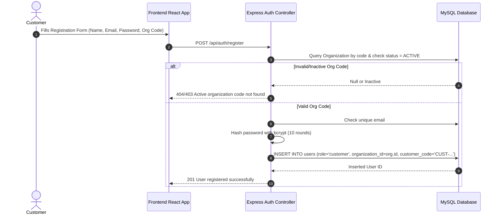
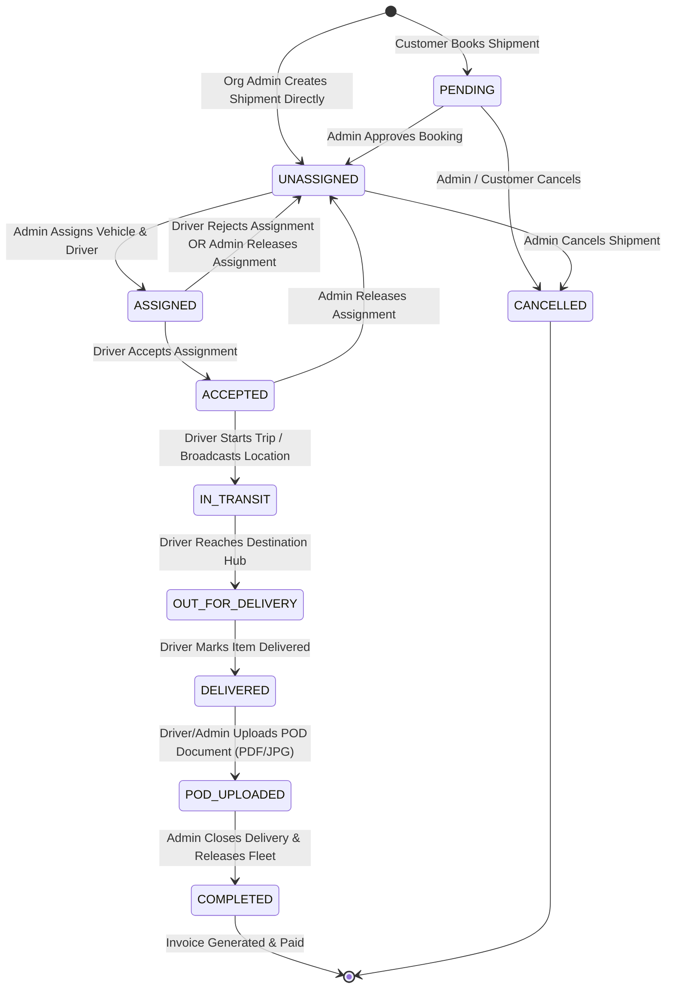
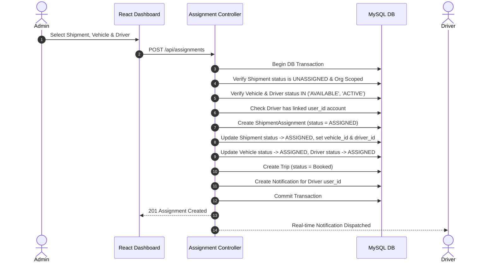
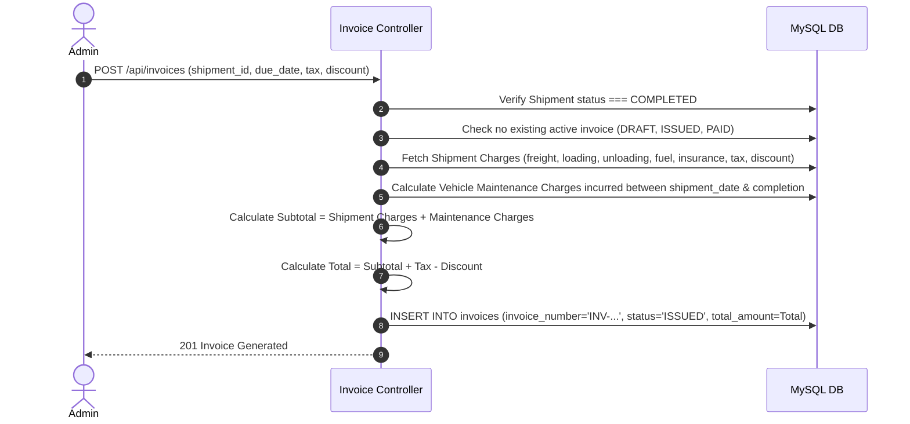

# Transport Management System: End-to-End Flow & Edge Cases Blueprint

> This master document provides a comprehensive end-to-end analysis of the entire **Transport Management System** (Backend: Express / MySQL / Sequelize; Frontend: React / Vite). It maps out system architecture, role permissions, module lifecycles, state machine transitions, edge cases, security considerations, and actionable recommendations.

---

## 1. System Architecture & Role Matrix

### 1.1 Architecture & Multi-Tenancy Design
- **Architecture**: Monolithic REST API backend (Express) connected to a MySQL database via **Sequelize ORM** and **MySQL2 Connection Pool**; React SPA frontend (Vite + React Router v6).
- **Multi-Tenancy Model**: Shared database, column-based multi-tenancy (`organization_id`). Every core entity (`users`, `vehicles`, `drivers`, `shipments`, `invoices`, `payments`, `trips`, `shipment_assignments`) is scoped by `organization_id`.
- **Subscription Tier Enforcement**: Organizations are bound to `organization_subscriptions` (`STARTER`, `PRO`, `ENTERPRISE`). Subscription quotas govern max users, max admins, max vehicles, and monthly shipment volume.

### 1.2 Role-Based Access Control (RBAC) Matrix

| Feature / Action | `super_admin` | `organization_admin` / `admin` | `customer` | `driver` |
| :--- | :---: | :---: | :---: | :---: |
| **System Organizations & Subscriptions** | Full (CRUD) | Read Own Org | None | None |
| **Global Analytics & Activity Logs** | Full | None | None | None |
| **Customer Accounts Management** | Full | Org-Scoped | Self Profile Only | None |
| **Fleet Management (Vehicles, Drivers, Maintenance, Fuel)** | Full (Global Fleet) | Org-Scoped | None | View Linked Driver |
| **Shipment Booking / Creation** | Full | Org-Scoped | Self-Service (Restricted) | None |
| **Shipment Approval & Assignment** | Full | Org-Scoped | None | Accept / Reject Assigned |
| **Live Location Tracking Updates** | View All | View Org | View Self | Broadcast GPS Location |
| **POD Upload & Delivery Status** | Full | Org-Scoped | View Own POD | Upload POD for Assigned |
| **Invoicing & Billing** | Full | Org-Scoped | View & Pay Own Invoices | None |
| **Payment Recording** | Full | Org-Scoped | Record Self Payment | None |

---

## 2. End-to-End Business Lifecycles & Data Flows

### 2.1 Customer Self-Registration & Authentication Flow

---

### 2.2 Shipment Lifecycle & State Machine Transitions

#### Detailed State Machine Rules & Constraints:
1. **PENDING**: Created by customer. Charges cannot be entered by customer. Fleet cannot be assigned.
2. **UNASSIGNED**: Admin approved customer booking or created by Admin directly. Ready for fleet assignment.
3. **ASSIGNED**: Vehicle and driver assigned via `ShipmentAssignment`. Vehicle and Driver status updated to `ASSIGNED`. Trip record created with status `Booked`.
4. **ACCEPTED**: Driver accepts assignment from mobile interface. Trip status updated to `ACCEPTED`.
5. **IN_TRANSIT**: Live location tracking started (`ShipmentTracking` entry created with coordinates). Trip status updated to `In Transit`.
6. **OUT_FOR_DELIVERY**: Vehicle near delivery location. Trip status updated to `Out for Delivery`.
7. **DELIVERED**: Physical package handed over. Trip status updated to `Delivered`.
8. **POD_UPLOADED**: Proof of Delivery file uploaded (`/api/pod/upload/:id`). POD file reference validated.
9. **COMPLETED**: Admin executes delivery closure. **AUTOMATIC TRIGGERS**:
   - Vehicle status reset to `AVAILABLE`.
   - Driver status reset to `AVAILABLE`.
   - Trip status set to `Completed`.
   - Assignment status set to `RELEASED`.
   - Notifications dispatched to Admin and Customer.

---

### 2.3 Fleet Assignment & Dispatch Flow

---

### 2.4 Live Location Tracking & GPS Dispatch Flow
1. **Driver Location Update (`POST /api/live-tracking/:shipmentId/location`)**:
   - Validates coordinates: Latitude `[-90, 90]`, Longitude `[-180, 180]`.
   - Validates speed ($\ge 0$), accuracy ($\ge 0$), heading (`[0, 360]`).
   - Ensures Driver has an `ACCEPTED` assignment for the shipment.
   - Inserts record into `shipment_tracking` table.
   - Automatically transitions status from `ASSIGNED` -> `IN_TRANSIT` on first GPS ping.

---

### 2.5 POD Submission & File Handling Flow
1. **Upload Endpoint (`POST /api/pod/upload/:id`)**:
   - Multer middleware validates file extension (`.pdf`, `.jpg`, `.jpeg`, `.png`, `.webp`) and max file size (5MB).
   - Saved to filesystem directory (`uploads/pod/`).
   - Database updated with stored reference (`/api/pod/files/:filename`).
   - Shipment status updated to `POD_UPLOADED`.
   - **Orphan File Protection**: If database update fails, uploaded file is unlinked immediately. If previous POD existed, old file is cleaned up.

---

### 2.6 Invoicing & Financial Settlement Flow

#### Payment Recording Flow (`POST /api/payments`):
- Verifies Invoice is in `ISSUED` status.
- Calculates existing total paid payments (`SUM(amount)` where `status = COMPLETED`).
- Ensures `New Payment Amount <= Remaining Balance`.
- Inserts `payments` record.
- **Auto-Status Closure**: If `New Total Paid >= Invoice Total Amount`, auto-updates Invoice status to `PAID`.

---

## 3. Exhaustive Edge Cases, Vulnerabilities & System Risks

### 3.1 Data State & Race Condition Edge Cases

#### Edge Case 1: Concurrent Assignment of the Same Vehicle or Driver
- **Scenario**: Two organization admins attempt to assign Vehicle `V-101` to two different shipments simultaneously.
- **Current Behavior**: Checked using non-locking `SELECT` statements (`Vehicle.findOne`). Both pass validation before update, resulting in double assignment or invalid state.
- **Impact**: High. Vehicles can be double-booked across active trips.
- **Mitigation**: Implement SELECT FOR UPDATE or database-level transactions with strict isolation (`SERIALIZABLE` or optimistic locking version fields).

#### Edge Case 2: Unlinked Driver Account Booking Attempt
- **Scenario**: An admin creates a driver in the fleet table without assigning a user account (`drivers.user_id = NULL`), then assigns them to a shipment.
- **Current Behavior**: `assignmentController.js` checks `if (!driver.user_id)` and returns `409 Selected driver does not have a linked driver login`.
- **Impact**: Handled, but requires clear UI validation when creating drivers.

#### Edge Case 3: Vehicle Maintenance Service Incurred During Trip
- **Scenario**: Vehicle undergoes maintenance during a long-haul trip. When invoice is generated, `getShipmentMaintenanceSummary` queries maintenance records between `shipment_date` and `updated_at`.
- **Edge Case Condition**: If `shipment_date` is `NULL`, fallback to `booking_date`. If maintenance record has date outside this window due to timezone mismatch, maintenance cost is omitted from invoice.
- **Mitigation**: Store UTC timestamps consistently across `booking_date`, `shipment_date`, and `service_date`.

---

### 3.2 Security, Multi-Tenancy & Authorization Risks

#### Risk 1: Multi-Tenant Data Leakage via Raw Query Scoping
- **Scenario**: Several controllers (`podController.js`, `invoiceController.js`, `paymentController.js`) mix Sequelize ORM queries and Raw SQL (`pool.query`).
- **Potential Flaw**: If `req.user.organization_id` is undefined or bypassed during API execution (e.g. broken auth token or misconfigured middleware), raw queries formatted as `AND (s.organization_id = ?)` with `[null]` will evaluate to `organization_id IS NULL` or return unintended records.
- **Mitigation**: Enforce strict middleware verification: Reject any non-super_admin request where `req.user.organization_id` is null or invalid before entering controller logic.

#### Risk 2: Path Traversal in File Delivery Endpoints (`/api/pod/files/:filename` & `/api/organizations/branding/files/:filename`)
- **Scenario**: Attacker passes `../` or encoded characters in filename parameter.
- **Current Mitigation**: Sanitized via `getStoredPodFilename` / `getStoredBrandingFilename` regex check `/^[a-f0-9-]+\.(pdf|jpg|png|webp)$/i` and `path.basename`.
- **Status**: Secure. Retain regex enforcement.

#### Risk 3: Stored XSS via HTML Template Invoice View (`GET /api/invoices/:id/template`)
- **Scenario**: User inputs malicious payload in shipment remarks or customer name (e.g., ``). `renderInvoiceTemplate` interpolates fields directly into HTML.
- **Impact**: High. Can execute arbitrary JavaScript in admin browser when viewing invoice template.
- **Mitigation**: Escape all dynamic fields inserted into HTML templates using HTML entity encoding libraries (e.g. `he.encode()`).

---

### 3.3 Financial & Boundary Condition Edge Cases

#### Edge Case 4: Floating Point Rounding Errors in Invoice Total
- **Scenario**: Multiple decimal line items (freight, tax rates, maintenance cost) added together. Floating point arithmetic in JavaScript (`0.1 + 0.2 = 0.30000000000000004`).
- **Current Behavior**: `invoiceController.js` uses `Number.parseFloat`. `paymentsController` checks `balance - paid <= 0.01`.
- **Impact**: Potential precision mismatches when checking full payment.
- **Mitigation**: Standardize on integer cents (multiply by 100 before storage/math) or use high-precision decimal math utilities (`bignumber.js` or SQL `DECIMAL(12,2)` rounding).

#### Edge Case 5: Overpayment & Negative Balance Handling
- **Scenario**: Admin enters payment amount exceeding invoice balance.
- **Current Behavior**: Explicitly blocked: `if (paid > balance + 0.01) return res.status(400).json({ message: "Payment cannot exceed remaining balance..." })`.
- **Status**: Secure.

---

### 3.4 Subscription & Multi-Tenant Quota Edge Cases

#### Edge Case 6: Subscription Limit Bypass on Concurrent Creation
- **Scenario**: An organization on `STARTER` plan has limit of 500 shipments/month. 10 users book shipments simultaneously near the 500 limit.
- **Current Behavior**: `checkSubscriptionLimit` counts current month shipments before transaction. Concurrent requests can pass the check simultaneously before insertions complete.
- **Mitigation**: Use atomic SQL increment counters or atomic transaction-level count checks.

---

## 4. End-to-End Edge Case Verification Matrix

| Area | Potential Failure Point | Expected System Guard | Current Code Status | Action Required |
| :--- | :--- | :--- | :--- | :--- |
| **Auth** | Inactive Org User Login | Block token generation | Verified (`authController.js`) | None |
| **Shipment** | Customer adding freight charges | Return 403 Forbidden | Verified (`shipmentsController.js`) | None |
| **Shipment** | Assign fleet without shipment approval | Return 409 Conflict | Verified (`assignmentController.js`) | None |
| **Assignment** | Assign driver with inactive vehicle | Return 409 Conflict | Verified (`assignmentController.js`) | None |
| **Tracking** | Driver updating GPS without assignment acceptance | Return 409 Conflict | Verified (`liveTrackingController.js`) | None |
| **POD** | Completing shipment without valid POD file | Return 409 Conflict | Verified (`podController.js`) | None |
| **POD** | Upload failed, orphan file on disk | Unlink file on catch | Verified (`podController.js`) | None |
| **Invoice** | Generating invoice for non-completed shipment | Return 409 Conflict | Verified (`invoiceController.js`) | None |
| **Invoice** | Template HTML Injection (XSS) | Escape HTML strings | Unescaped in `invoiceTemplate.js` | **High Priority Fix** |
| **Payment** | Paying cancelled invoice | Block payment creation | Verified (`paymentController.js`) | None |

---

## 5. Architectural Recommendations & Hardening Plan

1. **HTML Entity Encoding for PDF/HTML Templates**:
   Wrap all dynamic string insertions in `renderInvoiceTemplate.js` with HTML entity escaping to eliminate Stored XSS vulnerability.
2. **Database Transactions with Pessimistic Locking**:
   Add `lock: transaction.LOCK.UPDATE` in Sequelize queries for vehicle and driver selection inside `assignmentController.js` to eliminate race conditions during dispatch.
3. **UTC Date Standardisation**:
   Ensure all date inputs (`booking_date`, `shipment_date`, `service_date`, `payment_date`) are normalized to UTC standard format before querying date ranges.
4. **Subscription Quota Atomic Locking**:
   Wrap subscription limit checks inside database transactions when performing bulk creations.

---

*End of End-to-End Flow & Edge Cases Blueprint*
